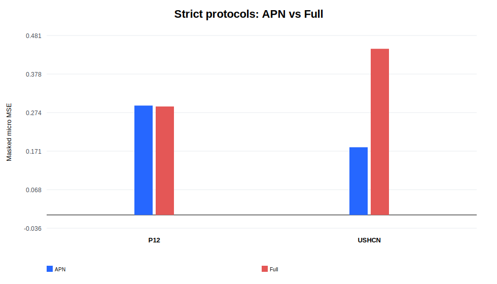
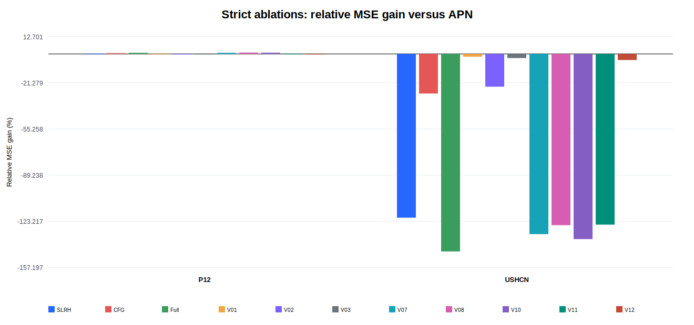

# EdgeTwinCal 实验室回报（封存确认性实验）

**最终结论：ABANDON。** 本回报只审计实验，不重写论文结论，也不依据已打开的测试集继续调参。

## 1. 完整性与边界

- 五个可运行实验单元均通过 G0/G1，完成并验证 180/180 个显式 run manifest。
- 每个单元恰好一次 test opening，均已关闭并 seal；token 未持久化。
- 统计使用 group × checkpoint crossed paired bootstrap（50,000 draws，seed 20260721）。
- 95% CI 是未校正 percentile CI；Holm 校正施加在 one-sided bootstrap p 值上，不能称为 Holm-adjusted CI。

## 2. 严格协议主结果

| 数据集 | APN MSE | Full MSE | 相对改善 | Full−APN MSE 95% CI | MAE 相对改善 95% CI | 配对 checkpoint | 分类 |
|---|---:|---:|---:|---:|---:|---:|---|
| P12 | 0.293087 | 0.290677 | 0.822% | [-0.004084, -0.000711] | [0.597%, 1.153%] | 5/5 | strong |
| USHCN | 0.181387 | 0.445268 | -145.480% | [-0.002005, 1.096122] | [-36.073%, -0.338%] | 0/5 | harmful |

P12 的 0.822% 改善在五个 checkpoint 上方向一致，primary Holm-adjusted p=0.005840；这是数据集特定的正结果。USHCN 的 Full MSE 增加 145.48%，且 MAE 增幅区间下界为 0.338%，越过预声明 0.2% harm margin，因此分类为 harmful。

## 3. 机制与范围门控

- G2：FAIL。P12 的简单控制和两种 shuffle 通过，但 V08 Joint 非劣性上界 0.4839% 超过 0.1% margin；反向顺序近似持平，不能声称顺序优势。
- USHCN 的简单控制、Joint、两种 shuffle 均不支持预期机制；V07 反向顺序更好，V10 缺少方差诊断。
- G3 strict：FAIL。要求两个严格数据集均 strong，实际为 1 strong + 1 harmful。
- G3 release broad-scope：FAIL。三个 release 数据集只有 checkpoint-level 描述统计，0/3 strong。
- G4：BLOCKED。没有真实 edge CPU/Jetson 测量；RTX 4090 不能替代 edge target。

## 4. Release 描述性结果

| 数据集 | APN MSE | Full MSE | 相对改善 | 标签 |
|---|---:|---:|---:|---|
| P12 | 0.312666 | 0.310093 | 0.823% | supportive |
| HumanActivity | 0.042168 | 0.042334 | -0.394% | safety-inconclusive |
| USHCN | 0.159725 | 0.342990 | -114.738% | safety-inconclusive |

这些 release split 的 group IDs 不可靠，不能把五个 checkpoint 当作独立患者或站点做确认性推断。

## 5. 失败根因

- 严格 P12 validation：APN MSE=0.309850，Full=0.307801，表观改善 0.661%。
- 严格 USHCN validation：APN MSE=1.010812，Full=0.548789，表观改善 45.708%；每个 seed 的 validation 有效目标很少且重尾。
- USHCN validation micro-MSE 被少数高杠杆 group 支配，因而偏好幅度不受限的 residual correction；该方向在封存 test 上翻转。
- checkpoint、fit-cache、fitted-state、manifest 哈希和零对角约束均通过审计，故不是状态迁移或实现重放错误。

## 6. 决策与下一步

- 按预声明 gate，当前路线判定 ABANDON；不得把 P12 的局部正结果包装为普遍收益。
- 已经是 APN 上的第五个结构性尝试：停止同一 baseline 的第六次路线，不用这些 test 继续迭代。
- 下一轮应切换 baseline，并使用全新的独立 target；可预注册 train-only robust/guarded adapter，但不能回写为本轮补救结果。
- MIMIC-III 缺 author mapping、HumanActivity participant IDs 不可靠、真实 edge target 不可用，继续保持 blocker，不伪造结果。

## 7. 可追溯文件

- confirmatory_aggregate.json：正式统计与 crossed bootstrap。
- pretest_terminal_summary.json：G0/G1、once-only 和 180/180 完整性复核。
- gate_decision.json：机器可读 gate 与 ABANDON。
- failure_diagnosis.json：只读取 train/val fit cache 与 sealed manifest cells 的诊断。
- EdgeTwinCal_lab_results.xlsx 及同目录 CSV：表格化结果和 provenance。
